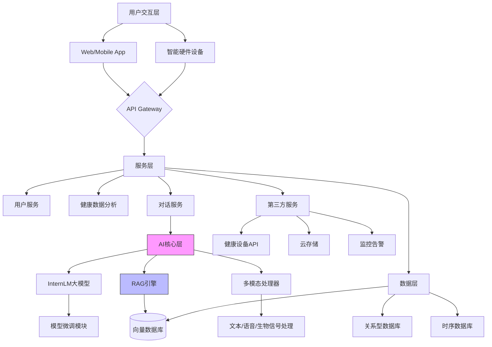

# HealthMate

### 1.Introduction

随着现代生活节奏加快，心理健康与生理健康的失衡问题日益突出。传统健康管理工具往往割裂心理与生理需求，且缺乏动态个性化的指导能力。

**HealthMate应运而生**：作为一款深度融合心理健康与生理健康管理的AI智能伴侣，项目目标是通过前沿AI技术，构建覆盖“身心一体”的全天候健康支持系统，帮助用户在日常生活中实现科学、可持续的健康管理规划。
**独特定位**：区别于单一功能健康应用，HealthMate以“全维度健康伙伴”为核心，结合实时数据分析与主动干预能力，在饮食、运动、睡眠、情绪等领域提供闭环式解决方案。

### 2.GitHub仓库结构：

~~~markdown
HealthMate/
├── 📁 docs/                   # 项目文档
│   ├── ARCHITECTURE.md       # 技术架构说明（含Clean Architecture图示）
│   ├── API_REFERENCE.md      # OpenAPI 3.0接口文档
│   └── DATA_FLOW.md         # 多模态数据处理流程
│
├── 📁 src/
│   ├── 📁 core/              # 业务核心（Clean Architecture核心层）
│   │   ├── 📁 domain/        # 领域模型
│   │   │   ├── health.py    # 健康画像模型（Pydantic）
│   │   │   └── advice.py    # 健康建议值对象
│   │   │
│   │   ├── 📁 services/      # 业务逻辑
│   │   │   ├── advisor.py   # 健康建议生成服务
│   │   │   └── risk.py      # 健康风险评估服务
│   │   │
│   │   └── 📁 repositories/  # 抽象接口
│   │       ├── health.py    # 健康数据仓库接口
│   │       └── knowledge.py # 医学知识库接口
│   │
│   ├── 📁 infrastructure/    # 基础设施层（技术实现）
│   │   ├── 📁 llm/          
│   │   │   ├── booksmart.py # 书生大模型调用
│   │   │   └── prompt_engineer/  # 提示词模板
│   │   │
│   │   ├── 📁 vector_db/     
│   │   │   ├── milvus.py    # Milvus向量库操作
│   │   │   └── faiss.py     # FAISS本地向量库
│   │   │
│   │   └── 📁 cache/
│   │       ├── redis.py     # Redis缓存实现
│   │       └── memory.py    # 内存缓存（测试用）
│   │
│   ├── 📁 entrypoints/       # 入口层
│   │   ├── 📁 api/           # FastAPI接口
│   │   │   ├── routers/     
│   │   │   │   ├── health.py # 健康建议路由
│   │   │   │   └── data.py   # 数据上传路由
│   │   │   └── middleware/  # 认证中间件
│   │   │
│   │   └── 📁 cli/           # 命令行工具
│   │       ├── advisor_cli.py 
│   │       └── data_import.py
│   │
│   ├── 📁 models/            # AI模型相关
│   │   ├── 📁 rag/           # RAG实现
│   │   │   ├── retriever.py # 混合检索器
│   │   │   └── reranker.py  # 重排序模型
│   │   │
│   │   └── 📁 fine_tuning/   # 模型微调
│   │       ├── lora_train.py # LoRA微调脚本
│   │       └── dataset.py    # 微调数据集处理
│   │
│   └── 📁 data_processing/   # 多模态数据处理
│       ├── wearable/        # 可穿戴设备解析
│       │   ├── apple_health.py
│       │   └── huawei_health.py
│       │
│       └── nlp/             # 自然语言处理
│           ├── emotion.py   # 情绪分析
│           └── diary_parser.py # 日志解析
│
├── 📁 data/                  # 数据管理
│   ├── 📁 raw/               # 原始数据
│   │   └── medical_knowledge/ # 医学文献库（PDF/XML）
│   │
│   └── 📁 processed/         # 预处理数据
│       ├── vectorized/      # 向量化知识库
│       └── normalized/      # 标准化健康数据
│
├── 📁 configs/               # 配置管理
│   ├── base.yaml            # 基础配置
│   ├── production.yaml      # 生产环境配置
│   └── secrets.yaml         # 密钥管理（git忽略）
│
├── 📁 tests/                 # 测试体系
│   ├── unit/                # 单元测试
│   │   ├── test_domain.py  
│   │   └── test_services.py
│   │
│   ├── integration/         # 集成测试
│   │   ├── test_llm.py     
│   │   └── test_retrieval.py
│   │
│   └── e2e/                 # 端到端测试
│       └── test_api_flow.py
│
├── 📁 scripts/              # 实用脚本
│   ├── init_knowledge.py    # 知识库初始化
│   └── benchmark.py         # 性能压测脚本
│
├── 📁 notebooks/            # 数据分析
│   ├── health_metrics_analysis.ipynb
│   └── rag_evaluation.ipynb
│
├── 📁 .github/              # CI/CD
│   └── workflows/          
│       ├── ci.yaml          # 单元测试流水线
│       └── deploy.yaml      # 生产部署流水线
│
├── Dockerfile               # 容器化部署
├── pyproject.toml           # 依赖管理
└── README.md                # 项目导航
~~~

### 3.技术架构图（Mermaid版）：

1. - ### 🛠️ **HealthMate 关键技术组件总结**

     ------

     #### **1. AI 核心引擎**

     | **技术**                | **功能与价值**                                               | **关键应用场景**                                 |
     | :---------------------- | :----------------------------------------------------------- | :----------------------------------------------- |
     | **书生大模型**          | 作为核心推理引擎，处理多模态健康数据，生成个性化建议。支持复杂健康场景的关联分析（如心理与生理数据联动） | 健康建议生成、风险评估、用户画像构建             |
     | **RAG（检索增强生成）** | 结合实时医学知识库与用户历史数据，提升建议的科学性和时效性，避免模型“幻觉” | 动态医学知识检索、个性化干预方案生成             |
     | **多模态数据分析**      | 整合传感器数据、文本日志、环境信息等多源数据，构建用户全维度健康画像 | 跨维度健康关联分析（如睡眠质量与情绪波动的关系） |

     ------

     #### **2. 数据处理与管道**

     | **技术**                | **功能与价值**                                               | **关键应用场景**                     |
     | :---------------------- | :----------------------------------------------------------- | :----------------------------------- |
     | **Apache Kafka**        | 消息总线实现数据异步处理与解耦，支持高吞吐量传感器数据的实时流处理 | 穿戴设备数据实时接入、多模块协同处理 |
     | **Flink CEP**           | 复杂事件处理引擎，实时检测健康异常模式（如连续高压工作后的焦虑倾向） | 实时健康风险预警、动态干预触发机制   |
     | **自然语言处理（NLP）** | 分析用户情绪日志、语音输入，提取结构化健康信息（情绪评分、压力关键词识别） | 心理健康状态评估、用户日志自动结构化 |

     ------

     #### **3. 存储与检索**

     | **技术**     | **功能与价值**                                               | **关键应用场景**                  |
     | :----------- | :----------------------------------------------------------- | :-------------------------------- |
     | **TDengine** | 高性能时序数据库，支持可穿戴设备高频数据存储与快速查询（如心率、步数的分钟级记录） | 长期健康趋势分析、实时数据可视化  |
     | **Milvus**   | 分布式向量数据库，存储医学知识库的嵌入向量，支持高效相似性检索 | 症状-疾病匹配、个性化医学文献推荐 |
     | **Neo4j**    | 图数据库构建健康知识图谱，表达疾病-症状-干预措施的复杂关系网络 | 健康风险路径推理、多因素关联分析  |

     ------

     #### **4. 服务与部署**

     | **技术**               | **功能与价值**                                               | **关键应用场景**                   |
     | :--------------------- | :----------------------------------------------------------- | :--------------------------------- |
     | **TensorFlow Serving** | 书生大模型的在线服务化部署，支持模型版本管理、动态加载与高性能推理 | 模型服务API暴露、AB测试与灰度发布  |
     | **Kubernetes**         | 容器编排管理，实现微服务的弹性扩缩容与高可用部署             | 生产环境服务集群管理、故障自动恢复 |
     | **FastAPI**            | 高性能API框架，提供RESTful与WebSocket接口，支持异步请求处理  | 用户端数据交互、第三方系统集成     |

     ------

     #### **5. 监控与可观测性**

     | **技术**       | **功能与价值**                                               | **关键应用场景**             |
     | :------------- | :----------------------------------------------------------- | :--------------------------- |
     | **Prometheus** | 实时采集服务指标（如API响应延迟、模型推理耗时），支持阈值告警与动态扩缩容决策 | 系统健康度监控、性能瓶颈定位 |
     | **Loki**       | 轻量级日志聚合系统，与Grafana集成实现日志可视化分析          | 业务异常排查、用户行为审计   |
     | **Jaeger**     | 分布式追踪系统，分析跨服务调用链路（如从数据接入到建议生成的完整路径） | 全链路性能优化、服务依赖分析 |

     ------

     #### **6. 安全与权限**

     | **技术**              | **功能与价值**                                               | **关键应用场景**             |
     | :-------------------- | :----------------------------------------------------------- | :--------------------------- |
     | **OAuth 2.0**         | 标准授权协议，保障用户数据隐私与第三方应用的安全接入         | 用户身份认证、API访问控制    |
     | **Open Policy Agent** | 策略即代码框架，实现细粒度权限管理（如医生与普通用户的数据访问权限差异） | 敏感医疗数据保护、合规性审计 |
     | **AES-256 加密**      | 对存储的医疗健康数据进行端到端加密，满足GDPR等数据安全法规   | 用户隐私数据存储与传输保护   |

     ------

     #### **7. 扩展与协作**

     | **技术**                | **功能与价值**                                               | **关键应用场景**                   |
     | :---------------------- | :----------------------------------------------------------- | :--------------------------------- |
     | **Airflow**             | 工作流调度系统，自动化执行知识库更新、模型微调等周期性任务   | 医学文献定时抓取、健康计划动态优化 |
     | **DVC（数据版本控制）** | 跟踪数据集与模型版本变更，支持实验复现与协作开发             | 模型迭代管理、多团队协作数据同步   |
     | **gRPC**                | 高性能RPC框架，用于微服务间通信（如数据处理层与AI核心层的高效交互） | 跨语言服务调用、低延迟数据传输     |
